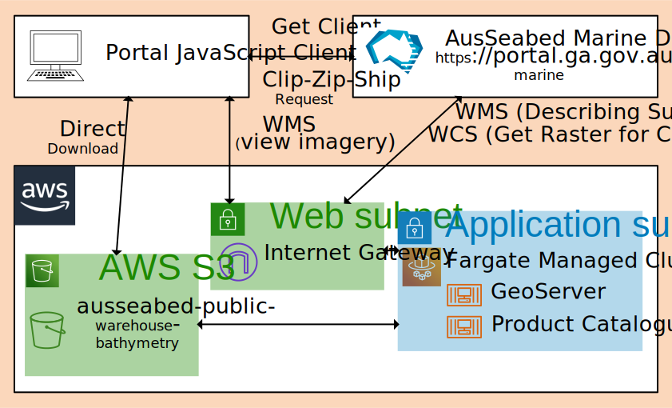

[](https://circleci.com/gh/ausseabed/warehouse-ogc-webservices)
<!-- omit in toc -->
# Contents
- [Introduction](#introduction)
- [Architecture](#architecture)
  - [Geoserver](#geoserver)
  - [Push on load](#push-on-load)
- [Continuous Delivery](#continuous-delivery)
  - [Build](#build)
  - [Publish](#publish)
  - [Deploy](#deploy)
  - [How to Deploy to Production](#how-to-deploy-to-production)
  - [How to Set the Snapshot Date](#how-to-set-the-snapshot-date)

# Introduction
AusSeabed is a national seabed mapping coordination program. The program aims to serve the Australian community that relies on seabed data by coordinating collection efforts in Australian waters and improving data access. 
 
This repository contains the code that builds OGC web service endpoints. The terraform code for deploying the infrastructure is housed in the https://github.com/ausseabed/ausseabed-aws-foundation/ repository.

# Architecture
The case where users want to view and download bathymetry data is supported by a number of tools and components. The primary discovery portal for users is the AusSeabed Marine Data Portal. This portal provides a map interface to discover and view bathymetry products. The Portal is desined as a JavaScript Client/Server Application with the Server infrastructure hosted on AWS. The Server acts as a intermediary between users of data products and providers of standards compliant OGC web services (Web Mapping Service and Web Coverage Service). The AusSeabed Data Warehouse acts as one of those providers of OGC web services. The service is provided by AWS ECS Fargate hosted Geoserver instances. The data behind the Geoserver instances is populated from data stores in AWS and the Product Catalogue.



The warehouse-ogc-webservices sit as a container called Geoserver in the figure above. The container itself contains an Apache Tomcat webserver with a Geoserver web app. During the container boot process, after Tomcat has finished booting Goeserver a command-line tool (Tomcat Push) populates Geoserver through Geoserver's REST interfaces. 

## Geoserver
Geoserver provides OGC webservices such as WMS and WCS. Geoserver is configured as per the base docker container (kartoza/geoserver). There is nothing particularly specialy about our configuration. The S3GeoTiff plugin provides capacity to reference cloud optimised geotiffs. Logging is adjusted to provide json output (and support better AWS insight queries).

The kartoza/geoserver docker container can run behind the latest Tomcat versions, so we push a version to our container repository based on latest upstream dependencies.

## Push on load
On load of the geoserver instance, the entrypoint warehouse-ogc-webservices/geoserver/geoserverpush/push_geoserver_settings.py runs to transfer information about layers from the Product Catalogue to the geoserver instance. The Product Catalogue restful interface is defined in the repo: https://github.com/ausseabed/product-catalogue. Geoserver is called through a set of restful libraries defined in the repo: https://github.com/ausseabed/geoserver-rest-client.

# Continuous Delivery
The continuous integration server (CircleCI) compiles, publishes and deploys the Warehouse to the development environment and production.
## Build
The steps involved in the build are:
* build kartoza base image (commiting to a branch with "build_and_push_kartoza" will cause a new image to be built with latest upstream dependencies). This image needs to be manually copied to production - a helper script copyKartozaImageToProduction.sh is available if appropriate AWS profiles are set up.
* build_tomcat_push_jar (create a launch script to pull configuration data)
* build_and_push_geoserver_image (incorporate the launch script and any other configuration details into a docker container)

## Publish
The kartoza/geoserver/tomcat image is published to AWS ECR on commit to a branch with "build_and_push_kartoza". Any commit to master will result in the warehouse geoserver image being committed to the development AWS ECR.

Publishing the container to production requires tagging the container: prod/publish/x.x.x

## Deploy
The infrastructure for the product catalogue sits in the [ausseabed-aws-foundation](https://github.com/ausseabed/ausseabed-aws-foundation) github repository. When run, that infrastructure-as-code will build VPC, subnets, internet gateways, an appropriate container cluster, etc. The terragrunt configuration explicitly states which version of the published artefacts should be deployed in the cluster in production (use latest in development). Since the task definition does not change in non-production, the service needs to be restarted for new infrastructure to be loaded up.

## How to Deploy to Production
1. Pull required changes from a feature branch to master
2. Test that the changes are acceptable in the development environment
3. Tag the artefacts on master: git tag prod/publish/X.X.X
4. Update the terragrunt version (pcat-app-deployment/terragrunt.hcl)
5. Tag the deployment on master: git tag prod/deploy/X.X.X
6. Approve the deployment on the CI system

Steps 2-5 should be written out in the do_deploy_warehouse step of CI server logs. E.g.,
```
git checkout master
git pull
git tag prod/publish/0.6.1
git push origin prod/publish/0.6.1
```
then update ausseabed-aws-foundation/geoserver-app-deployment/terragrunt.hcl in 
git clone git@github.com:ausseabed/ausseabed-aws-foundation.git
with
```
git checkout master
git pull
git checkout -b warehouse-rel/0.6.1
sed -i "s/\(ausseabed-geoserver:\)0.6.0/\10.6.1/" terragrunt.hcl
git add terragrunt.hcl
git commit -m "Update warehouse version"
git push origin warehouse-rel/0.6.1
```

then run:

```
git checkout master
git pull
git tag prod/deploy/0.6.1
git push origin prod/deploy/0.6.1
```

Note: The warehouse will automatically deploy a new task into production by virtue of the ECR image changing. However, in non-production, the existing service will need to be restarted as it won't recognise the new deploy has changed what latest means.

## How to Set the Snapshot Date
The geoserver pull script requests a snapshot of the product catalogue on a particular date. This date is pinned in the CI server. To update the snapshot date in production:
1. Set the date/time in UTC 8601 format to the CI value
```
TF_VAR_geoserver_snapshot_iso_datetime = 2020-08-12T06:59:54+0000
```
2. Deploy a new task definition by tagging the warehouse repo. E.g.,
```
git checkout master
git pull
git tag prod/deploy/0.1.5.2
git push origin prod/deploy/0.1.5.2
```

This line is purely to run a push test.
